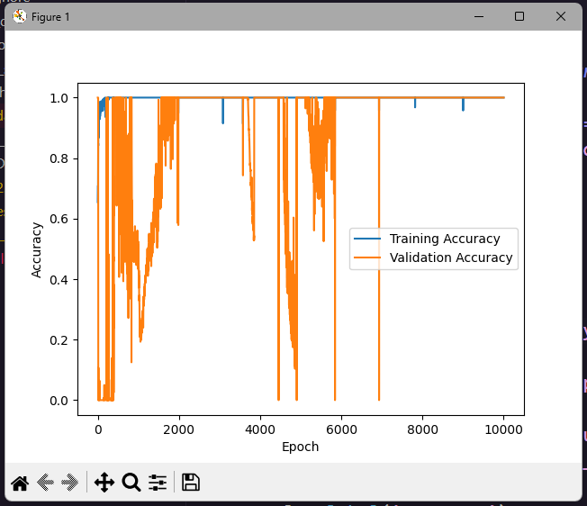

# ML-Cran

Проект машинного обучения - для мостового крана.
Проект направлен на уменьшение раскаченность груза


Data structure
```py
[
  [timestamp1, timestamp2, timestamp3, timestamp4, ...],
  [X1, X2, X3, X4, X5, X6, X7, ...],
  [Y1, Y2, Y3, Y4, Y5, Y6, Y7, ...]
]
```
Description
- timestamp - временная метка
- x - отклонение от центра кадра
- y - отклонение от центра кадра
- mark - метка
---

Датасет не является настоящим. Был сгенерирован с использованием стороннего софта

- dataset 1000 rows
- batch = 20 rows
- Training data = 35 batchs
- Testing data = 15 batchs

10к epoch


